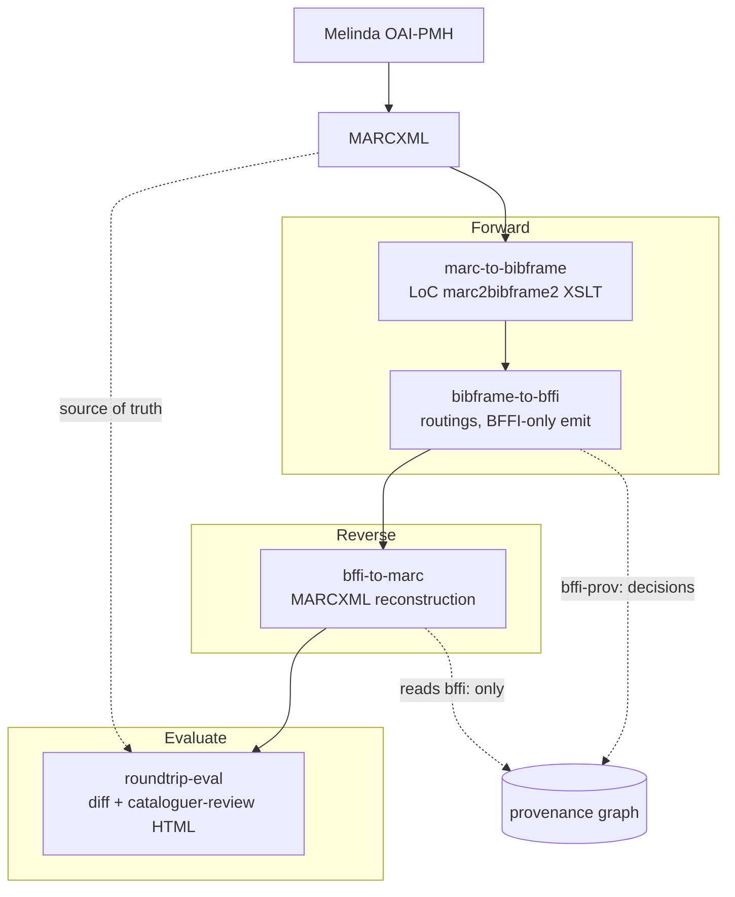

# BFFI conversion pipeline

Bidirectional conversion between MARCXML and [BFFI](https://schema.finto.fi/bffi/)
(the National Library of Finland's
BIBFRAME application profile), by way of BIBFRAME:

```
MARCXML  →  BIBFRAME  →  BFFI canonical Turtle  →  MARCXML
```

Both directions are first-class. The forward path converts source
bibliographic records into BFFI; the reverse path reconstructs MARCXML
from the BFFI graph alone, which is what makes the round-trip a
falsifiable test of the mapping rather than a one-way assertion about it.

This is **pro bono** work for the [National Library of Finland](https://www.kansalliskirjasto.fi/),
intended for upstream contribution alongside the existing NLF tooling.
Code is **MIT** (Copyright © 2026 Mikko Vihonen); published RDF data is **CC0**
(matching Finto vocabularies).

## Badges

[](https://github.com/mikkovihonen/bffi-conversion-pipeline/actions/workflows/ci.yml)
[](.github/workflows/ci.yml)
[](https://mikkovihonen.github.io/bffi-conversion-pipeline/)
[](LICENSE)
[](https://www.python.org/downloads/)
[](pyproject.toml)

## Why the round-trip

A forward-only converter can't tell you what it silently dropped. Running
MARC → BFFI → MARC and diffing against the source turns every mapping
shortfall into a visible artifact: a `lost` field, an `added` field, or a
`changed` value. The round-trip diff is therefore the primary quality
signal in this repository, not a nice-to-have.

Two disciplines keep the diff honest:

- **The `bffi:` namespace is closed.** Only terms declared in
  `vocab/lkd.rdf` may be emitted. When the ontology has no term for
  something, the converter drops it *visibly* rather than inventing a
  local term to make the diff look better.
- **The reverse converter reads `bffi:` only.** It never consults the
  BIBFRAME intermediate, and never reads `bffi-prov:` pipeline-internal
  provenance to decide what to emit. If a field survives the round-trip,
  it survived through the canonical graph.

Where the round-trip provably cannot be byte-identical, the reasons are
enumerated rather than hidden — see the "Known limitations" section of
[`docs/bffi_to_marc_mapping.md`](docs/bffi_to_marc_mapping.md).

## Architecture



Stage code lives in [`src/bffi_pipeline/stages/`](src/bffi_pipeline/stages/);
orchestration in [`src/bffi_pipeline/cli.py`](src/bffi_pipeline/cli.py).
Stages don't import each other.

The MARCXML at the head of the diagram is produced upstream, outside
this repository. This repository takes MARCXML as given and never
touches the ILS.

## Prerequisites

- **Python 3.14** via [uv](https://github.com/astral-sh/uv) — everything is pinned in `uv.lock`.
- **`xsltproc`** on `PATH` — the marc2bibframe2 stylesheets are XSLT 1.0
  and are invoked as a subprocess, unchanged (see
  [`stages/marc_to_bibframe/xslt.py`](src/bffi_pipeline/stages/marc_to_bibframe/xslt.py)).
  Ships with macOS; `apt install xsltproc` on Debian/Ubuntu.
- **git with submodule support** — `marc2bibframe2` is vendored under
  `third_party/` as a submodule. Clone with `--recurse-submodules`, or run
  `git submodule update --init --recursive` after cloning.
- **Docker or Podman** — only for the optional local observability stack.
  No container is needed to run a conversion.

```sh
git clone --recurse-submodules <this-repo>
cd bffi-conversion-pipeline
uv sync
make test
```

## Running a conversion

Every invocation writes into a canonical run directory
(`runs/<yyyymmdd-hhmm-6hex>/`). Mint one with `new-run` and pass sub-paths
to each stage — the CLI rejects non-canonical output paths before the
stage starts.

```sh
RUN=$(uv run bffi-pipeline new-run)

uv run bffi-pipeline marc-to-bibframe \
    --input-dir tests/data/sample-marcxml/curated --output-dir $RUN/bibframe
uv run bffi-pipeline bibframe-to-bffi \
    --input-dir $RUN/bibframe --output-dir $RUN/bffi
uv run bffi-pipeline bffi-to-marc \
    --input-dir $RUN/bffi --output-dir $RUN/marc-out
uv run bffi-pipeline roundtrip-eval \
    --source-dir tests/data/sample-marcxml/curated \
    --reconstructed-dir $RUN/marc-out \
    --html $RUN/review.html
```

Both forward stages validate as they go, on by default. Rejected records —
structurally invalid MARCXML (unreadable filename, non-UTF-8, bad XML, XSD
failure), or a conversion that fails the BIBFRAME shape (no title, severed
Work↔Instance link, no administrative layer) — are listed in
`<output_dir>/_errors.jsonl` and are absent from the output. Content-thin
records and BFFI shape findings are flagged in
`<output_dir>/_validation.jsonl` and still converted. `--no-validate` turns
a stage's checks off; `marc-to-bibframe --no-strict-shapes` downgrades the
BIBFRAME shape check to a flag. See
[`docs/validation-strategy.md`](docs/validation-strategy.md).

Conversions are deterministic: the same input produces the same output,
so a re-run into a fresh run directory is safe. Note that the three
conversion stages currently **overwrite unconditionally** — they do not
yet implement the atomic-write and skip-when-newer behaviour that
`CLAUDE.md` sets as the convention, and there is no `--force` flag to
override. `melinda-sync` is the one stage that does (atomic `.tmp` →
rename, resumption-token idempotency, `--force-restart`). Closing that
gap for the conversion stages is outstanding.

`bffi-pipeline --help` lists every command, including the diagnostics
(`diagnose-mappings`, `diagnose-marc-coverage`) and the mapping-doc
regenerators.

## Observability

Every stage emits structured events to a `stage-events.jsonl` sidecar in
its run directory, from each stage's first commit — this is built in from
the ground up, not bolted on. A local Prometheus + Grafana stack behind
Caddy turns those events into live panels:

```sh
make observability-up     # → http://localhost:8080
make observability-down
```

Everything runs on the operator's machine. There is **no outbound
telemetry or error reporting** — no Datadog, Sentry, or similar. See
[`docs/observability.md`](docs/observability.md).

## Documentation

| Document | What it is |
|---|---|
| [`docs/marc_to_bibframe_mapping.md`](docs/marc_to_bibframe_mapping.md) | Generated: what the LoC XSLT does with each MARC field. |
| [`docs/bf_to_bffi_mapping.md`](docs/bf_to_bffi_mapping.md) | Generated: every `bf:*` class/predicate → its `bffi:*` counterpart. Source of truth for forward-direction decisions; "Gap clusters" carry the ontology-shortfall caveats. |
| [`docs/bffi_to_marc_mapping.md`](docs/bffi_to_marc_mapping.md) | Generated: every MARC field the reverse converter emits, plus "Known limitations". |
| [`docs/roundtrip-debugging.md`](docs/roundtrip-debugging.md) | How to debug a field that is lost, retagged or fabricated in the round-trip: the measurement discipline, how to localise the failing hop, and the catalogue of failure patterns behind every fix so far. |
| [`docs/validation-strategy.md`](docs/validation-strategy.md) | The three validation boundaries: MARCXML in, BIBFRAME post-conversion, BFFI post-emit. |
| [`docs/observability.md`](docs/observability.md) | The local metrics stack, end to end. |
| [`docs/plans/`](docs/plans/) | Plans of record, one per file, indexed by [`docs/plans/README.md`](docs/plans/README.md). |
| [`vocab/lkd.rdf`](vocab/lkd.rdf) | The full BFFI 1.0.0 ontology, vendored (the canonical schema URL returns 403 outside the Finto network). The closed set of terms we may emit. |

The three mapping docs are generated from the code, not hand-maintained.
Regenerate them when the emit changes:

```sh
uv run bffi-pipeline regenerate-mapping-tables            # bf_to_bffi
uv run bffi-pipeline regenerate-marc-mapping              # bffi_to_marc
uv run bffi-pipeline regenerate-marc-to-bibframe-mapping  # marc_to_bibframe
```

A fourth generated artifact is the synthetic field-coverage corpus — one
minimal and one maximal MARCXML probe per MARC tag the pipeline claims to
handle, used to answer "what actually survives a round-trip?":

```sh
uv run bffi-pipeline regenerate-field-coverage-corpus   # tests/data/.../field-coverage/
```

CI runs all four commands with `--check`, which writes nothing and exits
non-zero if a committed artifact differs from generator output. So a change
to the emit, a `vocab/` refresh, or a `third_party/marc2bibframe2` submodule
bump fails the build until you regenerate and commit the diff — CI never
rewrites these for you, because the mapping docs are the artifacts sent to
NLF for review. See
[`docs/plans/p-061-field-coverage-corpus.md`](docs/plans/p-061-field-coverage-corpus.md)
for what the corpus does and does not measure.

## Testing

```sh
make lint   # ruff check + ruff format --check + mypy --strict
make test   # pytest
```

Both must pass before any commit; a pre-commit hook installs itself on
first `make` run and enforces it for commits touching `*.py`. The suite
is entirely offline — unit tests run against fixtures under
`tests/data/`, never against external services. CI runs the same two
commands on GitHub-hosted Ubuntu runners.

Beyond ordinary coverage, the suite pins the two namespace disciplines
directly: `tests/unit/test_bffi_namespace_discipline.py` fails on any
emitted `bffi:` term absent from `vocab/lkd.rdf`, and
`tests/unit/stages/bffi_to_marc/test_bffi_prov_discipline.py` fails if the
reverse converter reads pipeline-internal provenance.

## Operating constraints

- **No paid API services.** Open-source tooling only.
- **No outbound telemetry.** The observability stack is local-only.
- **`mypy --strict`** across `src/`. Pydantic v2 at module boundaries;
  frozen dataclasses for internal value objects.
- **Errors over silent fallbacks.** Conversion failures raise; the only
  retries are for transient external errors.
- **Provenance is mandatory.** Every non-trivial conversion decision
  writes to the provenance graph before returning — there is no
  "optional logging" flag. Both forward stages emit a per-record
  `<bib_id>.prov.ttl` sidecar beside the record's output, carrying the
  conversion Activity and one `bffi-prov:decision` triple per routing
  that fired. See
  [`docs/plans/p-060-conversion-provenance.md`](docs/plans/p-060-conversion-provenance.md).

## Committed identifiers (do not change without surfacing)

| Namespace | URI |
|---|---|
| Work | `http://urn.fi/URN:NBN:fi:bib:work:` |
| Expression | `http://urn.fi/URN:NBN:fi:bib:expression:` |
| Manifestation | `http://urn.fi/URN:NBN:fi:bib:manifestation:` |
| Source | `http://urn.fi/URN:NBN:fi:bib:source:local` |
| `bffi-prov` | `http://urn.fi/URN:NBN:fi:schema:bffi-prov#` |

## License

Code: [MIT License](LICENSE). Copyright (c) 2026 Mikko Vihonen.

Published RDF data: [CC0 1.0 Universal](https://creativecommons.org/publicdomain/zero/1.0/),
matching the Finto vocabulary licensing.

## Implementation

This pipeline is developed and run with [Pi Coding Agent](https://github.com/earendil-works/pi-coding-agent) via
[pi-container](https://mikkovihonen.github.io/pi-container/) — an agentic coding
sandbox that wraps pi in a reproducible container. See the pi-container docs
for the full setup.
