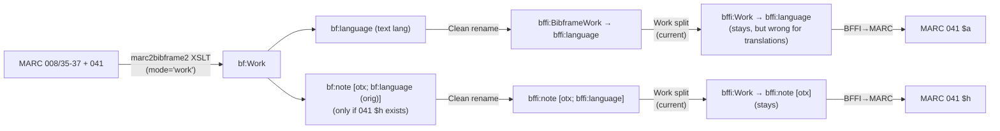
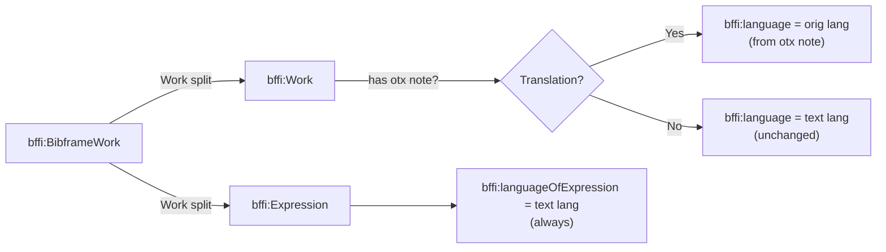

# Full Semantic Split: `bffi:language` on Work, `bffi:languageOfExpression` on Expression

## Problem Statement

`bffi:language` should be the **original/conceptual language** on `bffi:Work`. `bffi:Expression` should carry `bffi:languageOfExpression` — the **language of the specific textual realization**. For translations these differ; for non-translations they're the same.

Currently the pipeline puts `bffi:language` on `bffi:Work` with the **text** language (from marc2bibframe2), and `bffi:Expression` has no language property at all.

## Current Data Flow



### Key insight: the BIBFRAME data IS sufficient

marc2bibframe2 emits two distinct structures from 041:

| 041 subfield | BIBFRAME output | Semantic meaning |
|---|---|---|
| `$a` (text language) | `bf:Work bf:language <.../languages/fin>` | Language of the Expression |
| `$h` (original language) | `bf:Work bf:note [a <.../resourceComponents/otx> ; bf:language <.../languages/rus>]` | Language of the Work |

The `resourceComponents/otx` ("original text") typed note is the **translation discriminator**. Its presence means the record is a translation, and its `bf:language` value is the **original/Work language**.

## Proposed Data Flow



### Example outputs

**Non-translation** (Finnish monograph, 008=`fin`, no 041 `$h`):
```turtle
<#Work> a bffi:Work ;
    bffi:language <.../languages/fin> .

[] a bffi:Expression ;
    bffi:languageOfExpression <.../languages/fin> ;
    bffi:expressionOf <#Work> .
```

**Translation** (Finnish translation of Russian novel, 041 `$afin $hrus`):
```turtle
<#Work> a bffi:Work ;
    bffi:language <.../languages/rus> ;              # original language
    bffi:note [ a <.../resourceComponents/otx> ;
                bffi:language <.../languages/rus> ] . # note preserved for $h round-trip

[] a bffi:Expression ;
    bffi:languageOfExpression <.../languages/fin> ;   # text language
    bffi:expressionOf <#Work> .
```

**Multi-language non-translation** (aria album, 041 `$ager $aita $afre`):
```turtle
<#Work> a bffi:Work ;
    bffi:language <.../languages/fre>, <.../languages/ger>, <.../languages/ita> .

[] a bffi:Expression ;
    bffi:languageOfExpression <.../languages/fre>, <.../languages/ger>, <.../languages/ita> ;
    bffi:expressionOf <#Work> .
```

---

## Proposed Changes

### Component 1: Forward conversion — Work split

#### [MODIFY] [routings.py](file:///Users/mikkovihonen/Workspace/bffi-conversion-pipeline/src/bffi_pipeline/stages/bibframe_to_bffi/routings.py)

**1a. Add `otx` detection constant** (near line 490):

```python
_RESOURCE_COMPONENTS_OTX: Final[URIRef] = URIRef(
    "http://id.loc.gov/vocabulary/resourceComponents/otx"
)
```

**1b. Extend `route_work_split()`** (after the existing property migration, line 535):

```python
# 4. Populate bffi:languageOfExpression on Expression
#    and fix bffi:language on Work for translations.
text_langs = list(graph.objects(subject, BFFI.language))

# Detect translation: any bffi:note typed resourceComponents/otx?
orig_langs: list[Node] = []
for note in graph.objects(subject, BFFI.note):
    if not isinstance(note, (URIRef, BNode)):
        continue
    if (note, RDF.type, _RESOURCE_COMPONENTS_OTX) in graph:
        for lang in graph.objects(note, BFFI.language):
            if isinstance(lang, URIRef):
                orig_langs.append(lang)

# Expression always gets the text languages.
for lang in text_langs:
    graph.add((expr_node, BFFI.languageOfExpression, lang))

# For translations: replace Work's bffi:language with the original language.
if orig_langs:
    for lang in text_langs:
        graph.remove((subject, BFFI.language, lang))
    for lang in orig_langs:
        graph.add((subject, BFFI.language, lang))
# For non-translations: Work keeps bffi:language as-is (= same as Expression).
```

> [!NOTE]
> The `otx` note structure is **preserved untouched** on the Work — only the direct `bffi:language` triples on the Work subject are reassigned. The note survives for 041 `$h` round-trip in the reverse direction.

---

### Component 2: Reverse conversion — BFFI→MARC extractors

#### [MODIFY] [extractors.py](file:///Users/mikkovihonen/Workspace/bffi-conversion-pipeline/src/bffi_pipeline/stages/bffi_to_marc/extractors.py)

**2a. `_extract_language_codes` (041 `$a`)** — line 3706:

Currently reads `BFFI.language` from Manifestation + Work + Expression. Must also read `BFFI.languageOfExpression` from Expression nodes so that the text language is found regardless of which predicate carries it:

```python
def _extract_language_codes(graph: Graph, manifestation: URIRef) -> list[str]:
    work = _find_work_for_manifestation(graph, manifestation)
    owners: list[URIRef | BNode] = [manifestation]
    if work is not None:
        owners.append(work)
    expressions = _expressions_for(graph, manifestation, work)
    owners.extend(expressions)

    codes: set[str] = set()
    # Read bffi:language from all owners (backward compat).
    for owner in owners:
        for obj in graph.objects(owner, BFFI.language):
            if isinstance(obj, URIRef):
                codes.add(local_name(obj))
    # Read bffi:languageOfExpression from Expression nodes.
    for expr in expressions:
        for obj in graph.objects(expr, BFFI.languageOfExpression):
            if isinstance(obj, URIRef):
                codes.add(local_name(obj))

    # For translations, bffi:language on Work is the ORIGINAL language
    # (= 041 $h, not $a). Exclude it from $a codes when otx notes exist.
    if work is not None:
        has_otx = any(
            (note, RDF.type, _RESOURCE_COMPONENTS_OTX) in graph
            for note in graph.objects(work, BFFI.note)
            if isinstance(note, (URIRef, BNode))
        )
        if has_otx:
            # Work's bffi:language is the original lang → belongs in $h, not $a.
            for obj in graph.objects(work, BFFI.language):
                if isinstance(obj, URIRef):
                    codes.discard(local_name(obj))

    if len(codes) > 1:
        codes -= _LANGUAGE_SUMMARY_CODES
    return sorted(codes)
```

> [!IMPORTANT]
> The `otx` guard prevents the original language from leaking into `$a`. Without it, a Finnish translation of a Russian novel would emit `$afin $arus` instead of just `$afin`.

**2b. `_extract_language_components` (041 `$h` etc.)** — line 3759:

**No change needed.** This function walks `bffi:note` nodes typed with `resourceComponents/*` and reads `bffi:language` from them. The `otx` note structure is preserved by the forward change, so `$h` reconstruction is unaffected.

**2c. Add the `_RESOURCE_COMPONENTS_OTX` constant** to extractors.py (it may already exist in `_RESOURCE_COMPONENT_TO_041_SUBFIELD` on line 3746 — reuse that URI):

```python
_RESOURCE_COMPONENTS_OTX: Final[URIRef] = URIRef(
    "http://id.loc.gov/vocabulary/resourceComponents/otx"
)
```

Already present as a key in `_RESOURCE_COMPONENT_TO_041_SUBFIELD` — can reference from there.

---

### Component 3: No vocabulary changes needed

[`lkd.rdf`](file:///Users/mikkovihonen/Workspace/bffi-conversion-pipeline/vocab/lkd.rdf) already defines all required properties:

| Property | Domain | Sub-property of | Status |
|---|---|---|---|
| `bffi:language` | `rdfs:Resource` | — | Already used ✅ |
| `bffi:languageOfExpression` | `bffi:Expression` | `bffi:language` | Already defined ✅ |
| `bffi:languageOfRepresentativeExpression` | `bffi:Work` | — | Exists but not needed here |

---

### Component 4: Decorator and docstring documentation

The pipeline uses two decorator-driven registries that auto-generate documentation. Both must be updated so `docs/bf_to_bffi_mapping.md` and `docs/bffi_to_marc_mapping.md` stay in sync with the code.

#### [MODIFY] [routings.py](file:///Users/mikkovihonen/Workspace/bffi-conversion-pipeline/src/bffi_pipeline/stages/bibframe_to_bffi/routings.py)

**4a. `@routing` decorator on `route_work_split`** (line 507–511):

The `replacement` text currently says `"bffi:Work (conceptual) + bffi:Expression (realisation)"`. Update to mention the language split:

```python
@routing(
    terms=(BFFI.BibframeWork,),
    replacement=(
        "`bffi:Work` (conceptual, `bffi:language` = original language) "
        "+ `bffi:Expression` (realisation, `bffi:languageOfExpression` = text language)"
    ),
    link_kind="entity split: BibframeWork → Work + Expression",
)
```

This flows into `ROUTING_REGISTRY` → `docs/bf_to_bffi_mapping.md` via [`mapping_tables.py`](file:///Users/mikkovihonen/Workspace/bffi-conversion-pipeline/src/bffi_pipeline/diagnostic/mapping_tables.py).

**4b. `route_work_split` function docstring** (line 512–518):

Update to document the new language semantics:

```python
def route_work_split(graph: Graph) -> int:
    """Split every `bffi:BibframeWork` into a conceptual `bffi:Work` and
    a specific `bffi:Expression`.

    The original subject is re-typed as `bffi:Work`. A new BNode is minted
    as the `bffi:Expression`, linked via `bffi:expressionOf`. Properties
    with an Expression domain are migrated to the new node.

    **Language split**: every direct ``bffi:language`` value on the Work is
    copied to the Expression as ``bffi:languageOfExpression``. For
    translations (detected by the presence of a ``bffi:note`` typed
    ``resourceComponents/otx``), the Work's ``bffi:language`` is replaced
    with the original language from the ``otx`` note, while the Expression
    retains the text language. The ``otx`` note structure itself is
    preserved for 041 ``$h`` round-trip fidelity.
    """
```

**4c. Module-level out-of-scope docstring** (line 54–61):

The module docstring currently says `bffi:languageOfExpression` is out of scope. Remove or update this since it's now implemented:

```python
# Current (lines 54-61):
# Out of scope for v0 — flagged in the mapping doc but deferred to a
# follow-on:
#
# - Hub routing currently picks the *type* per marcKey signals but does
#   NOT also attach the optional facet predicates (``bffi:languageOfExpression``,
#   ``bffi:musicKey``, ``bffi:version``). Those are nice-to-have signal
#   promotions; the type rewrite is what unblocks closed-namespace
#   discipline.

# Updated:
# Out of scope for v0 — flagged in the mapping doc but deferred to a
# follow-on:
#
# - Hub routing currently picks the *type* per marcKey signals but does
#   NOT also attach the optional facet predicates (``bffi:musicKey``,
#   ``bffi:version``). Those are nice-to-have signal promotions; the
#   type rewrite is what unblocks closed-namespace discipline.
#   ``bffi:languageOfExpression`` is now handled by the Work split
#   (routing 4b).
```

#### [MODIFY] [extractors.py](file:///Users/mikkovihonen/Workspace/bffi-conversion-pipeline/src/bffi_pipeline/stages/bffi_to_marc/extractors.py)

**4d. `@marc_emit` decorator on `_extract_language_codes`** (line 3645–3704):

The `source` field describes the BFFI graph pattern that produces 041 `$a`. Update to reflect dual-predicate reading and the otx guard:

```python
@marc_emit(
    MarcEmitMeta(
        tag="041",
        indicators=(" ", " "),
        subfields=(
            ("a", "3-letter language code (one per language)"),
            ("h", "language of the original"),
            ("i", "language of intertitles"),
            ("j", "language of subtitles"),
            ("k", "language of intermediate translations"),
            ("m", "language of accompanying material"),
            ("n", "language of the original libretto"),
            ("p", "language of captions"),
            ("q", "language of accessible audio"),
            ("r", "language of accessible visual language"),
        ),
        source=(
            "\\$a: ?expression bffi:languageOfExpression "
            "<http://id.loc.gov/vocabulary/languages/{code}> "
            "(preferred), falling back to ?work or ?m bffi:language "
            "for backward compatibility. "
            "For translations (otx note present), ?work bffi:language "
            "carries the original language and is excluded from \\$a. "
            "\\$h and the other component codes: "
            "?work bffi:note [a <http://id.loc.gov/vocabulary/resourceComponents/"
            "{component}> ; bffi:language <…/languages/{code}>], where the "
            "component URI selects the subfield (otx → \\$h, sub → \\$j, …)"
        ),
        notes=(
            "**The sub-language codes do survive the forward hop** — an earlier "
            "note here claimed they collapse into flat bffi:language URIs, and "
            "that is wrong. ``ConvSpec-010-048.xsl``'s ``parse041`` wraps every "
            "subfield in the ``hijkmnpqr`` set in a ``bf:Note`` typed with a "
            "``resourceComponents`` URI carrying the language inside, so the "
            "sub-code is recoverable: \\$h (otx) is emitted from "
            "``bffi:note [a <…/resourceComponents/otx> ; bffi:language ?lang]``, "
            "and likewise \\$i \\$j \\$k \\$m \\$n \\$p \\$q \\$r. "
            "26 source \\$h and 10 \\$j occurrences in the fixture corpus; "
            "9 records' 041s became byte-identical when this landed.\n\n"
            "**Language split**: the forward converter's Work split populates "
            "``bffi:languageOfExpression`` on Expression nodes with the text "
            "language, and for translations replaces the Work's ``bffi:language`` "
            "with the original language (from the ``otx`` note). This extractor "
            "reads both predicates and uses the ``otx`` presence as a guard to "
            "exclude the Work's original language from ``\\$a``.\n\n"
            "**Not recovered:** the ``bdefgt`` set (\\$b summary, \\$d sung or "
            "spoken text, \\$e librettos, \\$f table of contents, \\$g "
            "accompanying material, \\$t transcripts), which the XSLT emits as "
            "``bf:accompaniedBy`` → ``bf:Work`` instead — a different shape this "
            "path doesn't walk (one \\$d in the corpus). A source \\$3 "
            "(materials specified) makes the XSLT drop the language outright, so "
            "those are unrecoverable at any stage.\n\n"
            "ind1=1 is asserted when \\$h is present (all 26 corpus \\$h "
            "carriers use ind1=1); the XSLT comments out its own ind1 handling, "
            "so ind1 is otherwise absent from BIBFRAME and stays blank rather "
            "than claiming '0' (not a translation) without evidence.\n\n"
            "\\$a order is not preserved — the codes come from an unordered "
            "RDF set and are emitted sorted, so a source whose first \\$a marks "
            "the predominant language loses that distinction. ``mul`` and "
            "``zxx`` are dropped from \\$a when other codes are present: they "
            "are 008/35-37 summary codes that leaked in as an extra \\$a, and "
            "in the corpus they appear in a source 041 only alone.\n\n"
            "Emitted whenever the graph carries a language statement, so a "
            "record whose language came only from 008 (no source 041) gains "
            "one — visible as `added` in the round-trip diff. Suppressing "
            "single-language 041s would remove ~31 such additions on the "
            "reference corpus but lose the 95 source 041s that are "
            "legitimately a single \\$a matching 008/35-37."
        ),
    )
)
```

**4e. `_extract_language_codes` function docstring** (line 3707):

Update to document the dual-predicate reading and otx guard:

```python
def _extract_language_codes(graph: Graph, manifestation: URIRef) -> list[str]:
    """Collect language codes for MARC 041 ``\\$a``.

    Reads ``bffi:languageOfExpression`` from Expression nodes (the primary
    source after the Work split) and ``bffi:language`` from all axes for
    backward compatibility. Returns 3-letter MARC language codes (the URI's
    local name), deduped and sorted.

    For translations (detected by an ``otx``-typed ``bffi:note`` on the
    Work), the Work's ``bffi:language`` carries the original language and
    is excluded from ``\\$a`` — it belongs in ``\\$h`` instead, which
    ``_extract_language_components`` handles via the note structure.
    """
```

**4f. Regenerate auto-docs** after implementation:

```bash
# Regenerate docs/bffi_to_marc_mapping.md from @marc_emit registry
uv run python -m bffi_pipeline.diagnostic.marc_mapping

# Regenerate docs/bf_to_bffi_mapping.md from @routing registry
uv run python -m bffi_pipeline.diagnostic.mapping_tables
```

Both generators walk the decorator registries (`MARC_EMIT_REGISTRY` and `ROUTING_REGISTRY`) — updating the decorators is sufficient; the docs regenerate automatically.

---

### Component 5: Test updates

#### [MODIFY] [test_routings.py](file:///Users/mikkovihonen/Workspace/bffi-conversion-pipeline/tests/unit/stages/bibframe_to_bffi/test_routings.py)

**New test: non-translation Work split copies language to Expression:**
```python
def test_route_work_split_copies_language_to_expression():
    """For non-translations, bffi:language stays on Work AND is copied
    to Expression as bffi:languageOfExpression."""
    g = Graph()
    w = URIRef("http://example.org/work")
    g.add((w, RDF.type, BFFI.BibframeWork))
    g.add((w, BFFI.language, URIRef(".../languages/fin")))
    
    route_work_split(g)
    
    expr = next(g.subjects(RDF.type, BFFI.Expression))
    assert (w, BFFI.language, URIRef(".../languages/fin")) in g
    assert (expr, BFFI.languageOfExpression, URIRef(".../languages/fin")) in g
```

**New test: translation Work split swaps Work language to original:**
```python
def test_route_work_split_translation_uses_original_language():
    """For translations (otx note present), Work gets the original language
    and Expression gets the text language."""
    g = Graph()
    w = URIRef("http://example.org/work")
    g.add((w, RDF.type, BFFI.BibframeWork))
    g.add((w, BFFI.language, URIRef(".../languages/fin")))  # text lang
    note = BNode()
    g.add((w, BFFI.note, note))
    g.add((note, RDF.type, URIRef(".../resourceComponents/otx")))
    g.add((note, BFFI.language, URIRef(".../languages/rus")))  # orig lang
    
    route_work_split(g)
    
    expr = next(g.subjects(RDF.type, BFFI.Expression))
    # Work has original language, NOT text language.
    assert (w, BFFI.language, URIRef(".../languages/rus")) in g
    assert (w, BFFI.language, URIRef(".../languages/fin")) not in g
    # Expression has text language.
    assert (expr, BFFI.languageOfExpression, URIRef(".../languages/fin")) in g
    # otx note survives on Work.
    assert (note, BFFI.language, URIRef(".../languages/rus")) in g
```

#### [MODIFY] [test_runner.py](file:///Users/mikkovihonen/Workspace/bffi-conversion-pipeline/tests/unit/stages/bffi_to_marc/test_runner.py)

- Add test verifying `bffi:languageOfExpression` on Expression produces 041 `$a`.
- Add test verifying that for a translation graph (otx note + `bffi:language` on Work ≠ Expression), only the Expression language appears in `$a` and the Work language appears in `$h`.

---

## Round-Trip Impact on `tests/data/sample-golden`

### Forward direction (MARC → BFFI)

| Record type | Count (approx) | Change |
|---|---|---|
| Non-translation (no 041 `$h`) | ~126 | Expression gains `bffi:languageOfExpression` (same value as Work's `bffi:language`) |
| Translation (has 041 `$h`) | ~26 | Work's `bffi:language` changes from text lang → original lang. Expression gains `bffi:languageOfExpression` with text lang |

### Reverse direction (BFFI → MARC)

| MARC field | Change | Risk |
|---|---|---|
| 041 `$a` | Now read from `bffi:languageOfExpression` on Expression (with fallback to `bffi:language`) | ✅ Stable — same codes, different source predicate |
| 041 `$h` | Still read from `otx` note structure (unchanged) | ✅ No change |
| 008/35-37 | Not produced by the reverse converter | ✅ N/A |

> [!WARNING]
> For the ~26 translation records, `bffi:language` on the Work changes value (e.g., `fin` → `rus`). The reverse extractor's `otx` guard ensures this doesn't leak into 041 `$a`. The MARC round-trip output should remain **byte-identical** for all 152 golden files.

### Edge case: original language = text language in `$h`

Some records may have 041 `$afin $hfin` (self-translation or cataloguing artefact). In this case:
- Work gets `bffi:language <.../fin>` (from otx)
- Expression gets `bffi:languageOfExpression <.../fin>` (from direct)
- Both are the same — correct and harmless.

### Edge case: multiple `$h` values

A record could have 041 `$hrus $hger` (original in two languages). The otx note structure handles this — each `$h` produces its own note bnode. All original languages get copied to Work's `bffi:language`.

## Verification Plan

### Automated Tests
```bash
# Unit tests for the routings change
uv run pytest tests/unit/stages/bibframe_to_bffi/test_routings.py -v -k language

# Unit tests for the reverse extractor
uv run pytest tests/unit/stages/bffi_to_marc/test_runner.py -v -k "041 or language"

# Full test suite
uv run pytest tests/ -v
```

### Manual Verification
- Run the full pipeline on the 152 golden records.
- Inspect a translation record's BFFI output to confirm `bffi:language` on Work = original language.
- Inspect a non-translation record to confirm both entities carry the same language.
- Run round-trip eval and verify zero new MARC diffs.
