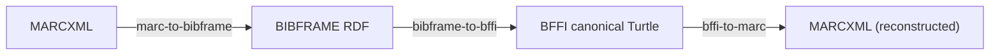
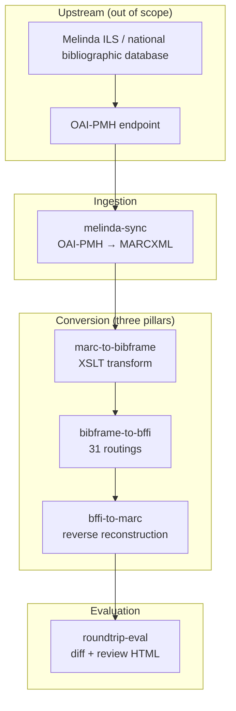
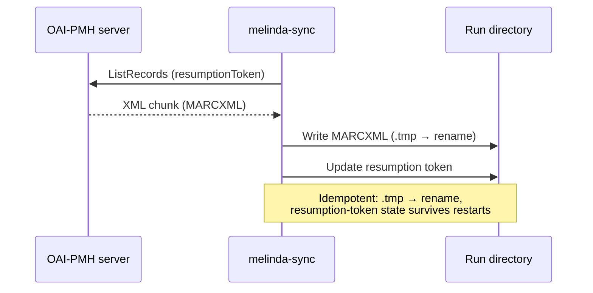
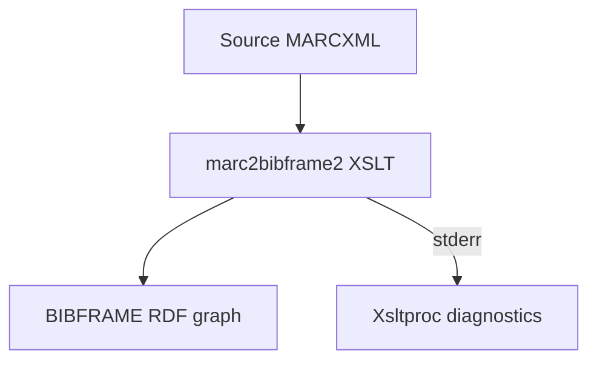
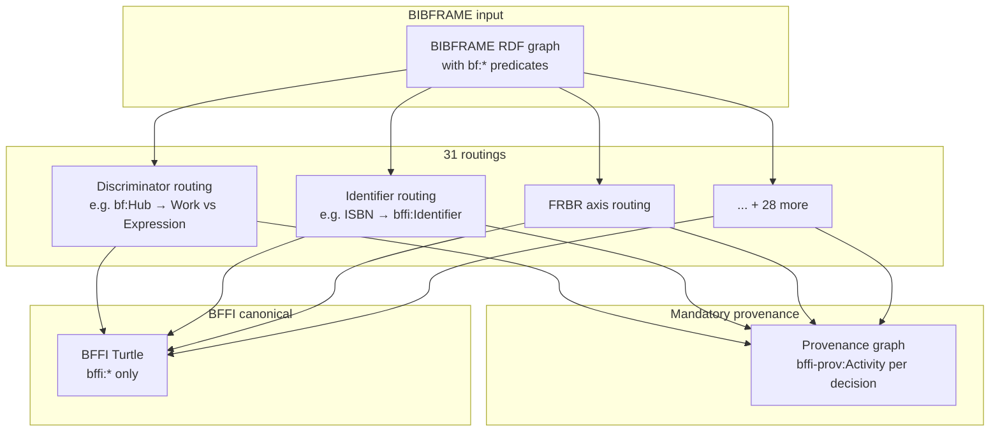
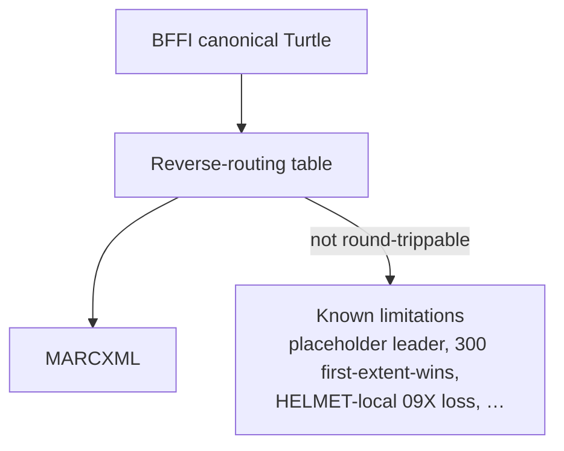
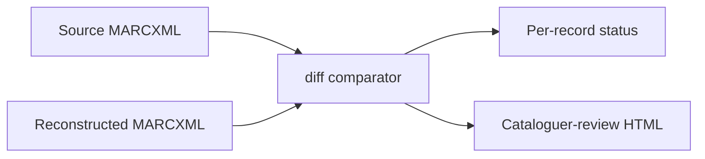
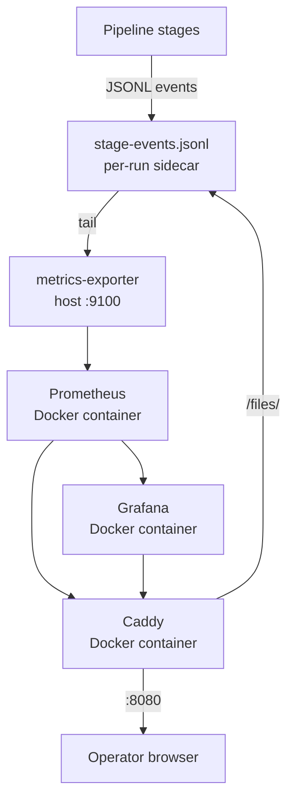
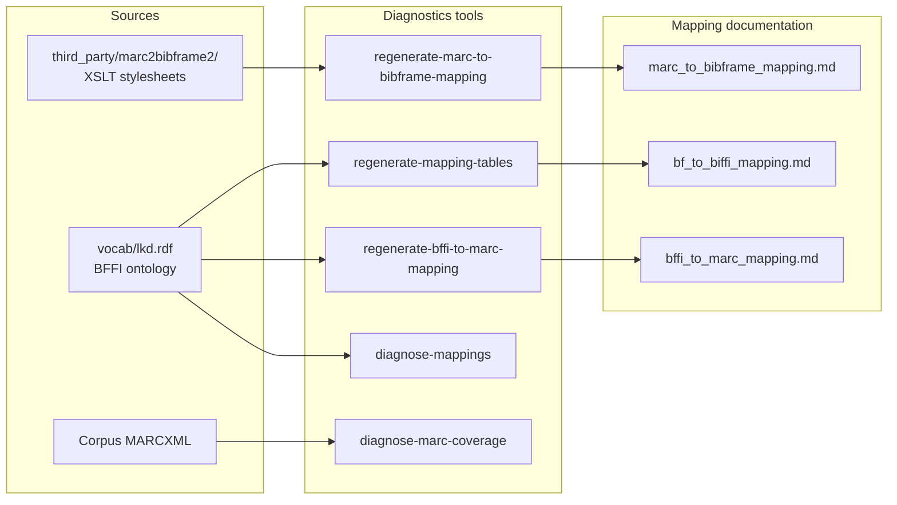
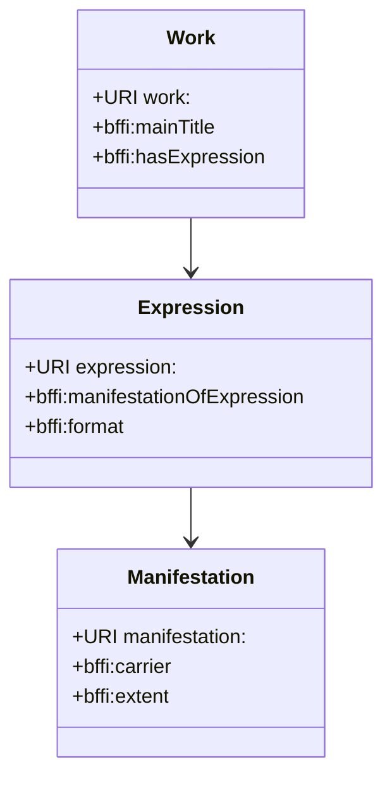

# BFFI Conversion Pipeline — Architecture Overview

This document gives a high-level view of the pipeline's data flows, stage
boundaries, and the surrounding diagnostic and observability tooling. It is
intended for operators who need to understand *what happens when you run the
pipeline*, not the per-field routing decisions — those live in the mapping
references.

## The three pillars

The pipeline is built around three conversion stages, each a self-contained
Python package that neither imports from nor is imported by the others.



| Stage | Input | Output | Implementation |
|---|---|---|---|
| `marc-to-bibframe` | MARCXML records | BIBFRAME RDF graph | LoC marc2bibframe2 XSLT (vendored, see `third_party/marc2bibframe2/`) |
| `bibframe-to-bffi` | BIBFRAME RDF graph | BFFI-only canonical Turtle | 31 discriminator routings in `routings.py`; mandatory provenance writes |
| `bffi-to-marc` | BFFI canonical Turtle | Reconstructed MARCXML | Reverse-routing table; see `docs/bffi_to_marc_mapping.md` for known limitations |

## Full pipeline data flow



## Stage detail

### 1. `melinda-sync` — OAI-PMH → MARCXML

Harvests bibliographic records from the Melinda OAI-PMH endpoint and writes
MARCXML files to the run directory. This is the **only** stage in the
repository that touches the network; the rest are purely local.



**Key properties:** atomic writes (`.tmp` → rename), resumable via token state,
the only stage with retry logic for transient network errors.

### 2. `marc-to-bibframe` — MARCXML → BIBFRAME

Runs the LoC marc2bibframe2 XSLT against each MARCXML record. The XSLT is
vendored under `third_party/marc2bibframe2/` and must not be modified —
wrap, don't fork.



**Key properties:** deterministic (same MARCXML → same BIBFRAME), failures
raise (no silent fallbacks), coverage documented in
`docs/marc_to_bibframe_mapping.md`.

### 3. `bibframe-to-bffi` — BIBFRAME → BFFI canonical Turtle

The heart of the forward direction. 31 discriminator routings in
`routings.py` walk the BIBFRAME graph, classify each entity, and emit
**only** `bffi:` URIs. The `bffi:` namespace is closed — zero `bf:*` URIs
may appear in the output graph.



**Key properties:** every non-trivial decision writes to the provenance graph
before returning; `bffi:` namespace discipline is enforced at emit time; the
mapping reference is generated from `vocab/lkd.rdf` and lives in
`docs/bf_to_bffi_mapping.md`.

### 4. `bffi-to-marc` — BFFI → MARCXML (reverse direction)

Reconstructs MARCXML from the canonical BFFI graph for round-trip
verification and downstream MARC consumers. This is the inverse of hop 2 + 3
combined.



**Key properties:** uses **only** the `bffi:` namespace — never reads
`bffi-prov:` for content decisions; see `docs/bffi_to_marc_mapping.md`
"Known limitations" for the full list of cases where reconstructed MARC
differs from source.

### 5. `roundtrip-eval` — Diff + Cataloguer review

Compares source MARCXML against the reconstructed MARCXML and produces:

- A structured diff report (per-record status: `identical` / `reordered` /
  `changed` / `lost` / `added`).
- A cataloguer-review HTML page for manual inspection of differences.



## Run directory layout

Every pipeline invocation writes into a canonical run directory minted with
`bffi-pipeline new-run`:

```
runs/
└── yyyymmdd-hhmm-<6hex>/
    ├── marc/                  # Input MARCXML (from melinda-sync or manual copy)
    ├── bibframe/              # marc-to-bibframe output
    ├── bffi/                  # bibframe-to-bffi output (canonical Turtle)
    ├── marc-reconstructed/    # bffi-to-marc output
    ├── eval/                  # roundtrip-eval output (diff + HTML)
    ├── stage-events.jsonl     # Observability sidecar (every stage writes here)
    └── .exporter.pid          # (only when serve-metrics is attached)
```

The CLI validates every stage's `--output-dir` against this convention —
non-canonical paths exit with `error: --output-dir: …` before the stage
starts.

## Observability stack



All local. The exporter tails sidecar JSONL files and serves Prometheus
metrics on `:9100`; Prometheus, Grafana, and Caddy run as Docker Compose
services behind `http://localhost:8080`. No outbound telemetry — no data
leaves the operator's machine.

See `docs/observability.md` for the full event schema, metric vocabulary,
and dashboard panel descriptions.

## Diagnostics & maintenance



These tools regenerate the mapping reference docs when source material
changes (XSLT updates, ontology additions, submodule bumps). The `--check`
flag catches drift without writing.

## FRBR model

The pipeline operates on the FRBR entity model — works, expressions, and
manifestations — which drives the discriminator routing in hop 3.

The `bffi-to-marc` reverse stage walks these relationships in the opposite
direction to reconstruct MARC fields. See `docs/roundtrip-debugging.md` for
the catalogue of failure patterns when a field goes missing, wrong, or
retagged in the reconstructed output.


